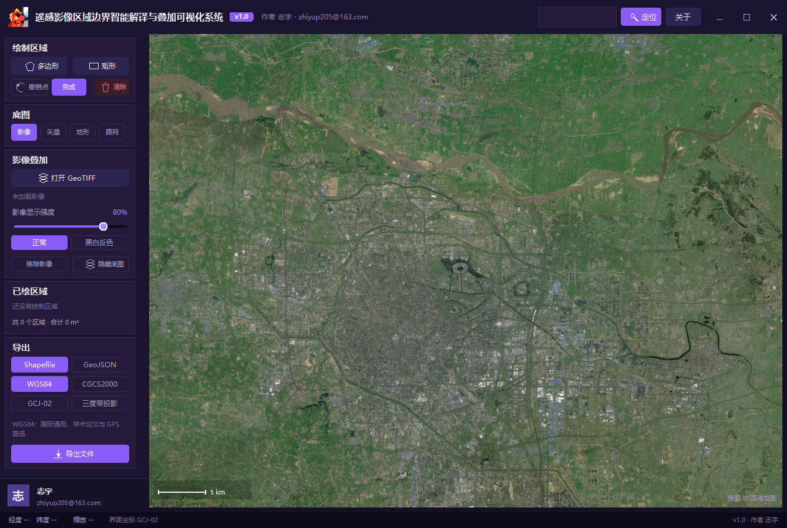
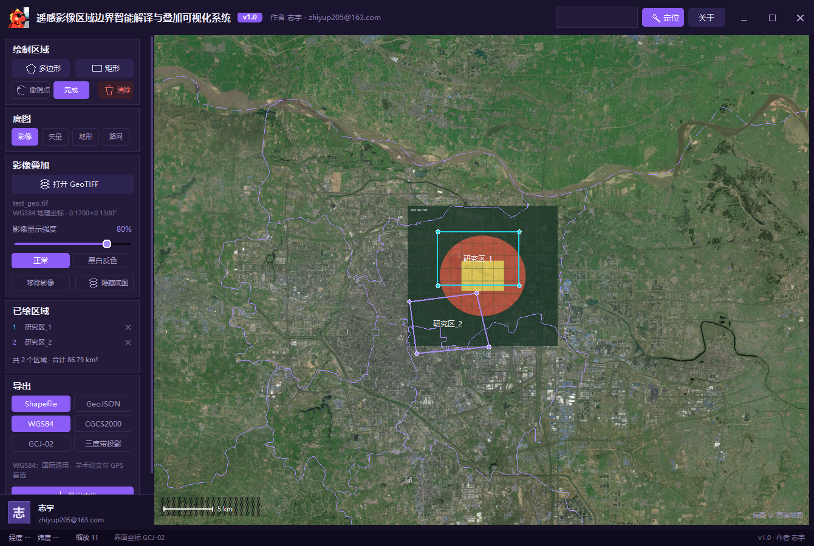
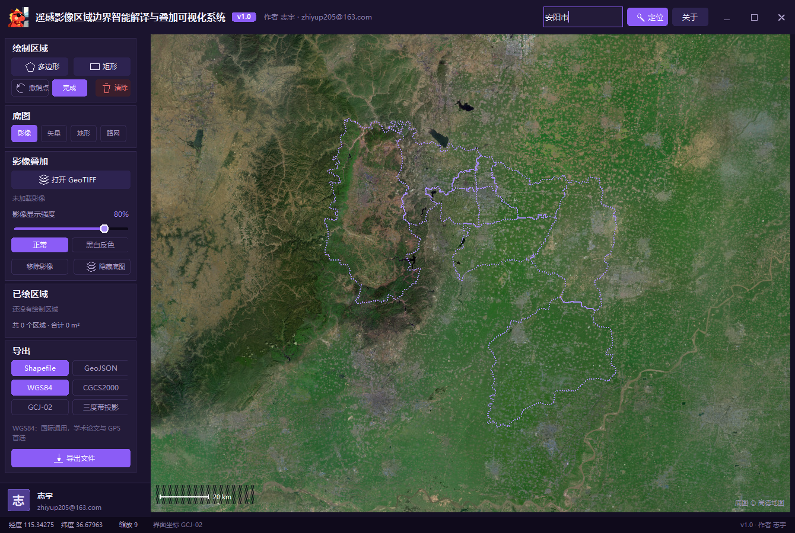
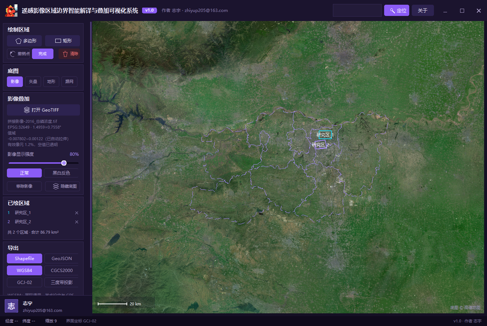
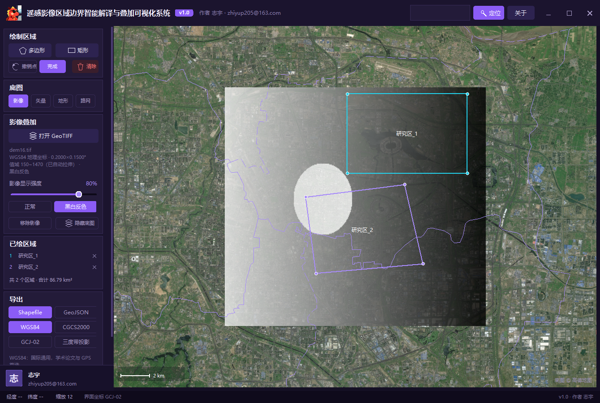

# 遥感影像区域边界智能解译与叠加可视化系统

面向遥感 / GIS 场景的 Windows 桌面软件：在地图上搜索定位行政区、绘制研究区，
把 GeoTIFF 遥感影像（DEM 高程、水质反演、NDVI 等单波段浮点影像均可）叠加到地图底图上，
并将绘制结果导出为 Shapefile / GeoJSON。

**单文件免安装**，双击即用。

## 下载

➡️ [**点击下载软件（exe，约 16 MB）**](遥感影像区域边界智能解译与叠加可视化系统.exe)

Windows 直接双击运行，无需安装任何环境。

## 主要功能

### 地图与边界
- 四种底图：影像 / 矢量 / 地形 / 路网，可随时切换
- 地名搜索定位：输入「洛阳市」「金水区」或行政区划代码「410100」回车即定位并绘制行政边界
- 研究区绘制：多边形逐点落点 / 矩形拖拽，实时显示面积与数量，支持撤销与单删

### 影像叠加
- 打开 GeoTIFF 即可叠加，自动识别 WGS84 / CGCS2000 地理坐标、UTM 与高斯投影
- 16 / 32 位整数及浮点影像自动做 2% ~ 98% 线性拉伸——DEM、反射率、反演结果免预处理
- NaN / NoData 自动透明；面板实时显示有效像元占比与实际值域
- 强度滑块（0 ~ 100%）、黑白反色（负片）、隐藏底图
- 亿级像元拼接影像约 1.5 秒打开

### 导出
- Shapefile（五件齐全）/ GeoJSON
- WGS84 / CGCS2000 / GCJ-02 / 高斯三度带投影可选，导出时自动换算

## 界面预览

  
  

  
  

更多截图见 [`docs/screenshots/`](docs/screenshots/)，完整功能说明见 [使用说明.txt](使用说明.txt)。

## 版本

- **v1.0** · 2026-10

## 作者

**志宇** · zhiyup205@163.com

---

© 2026 志宇。保留所有权利。
